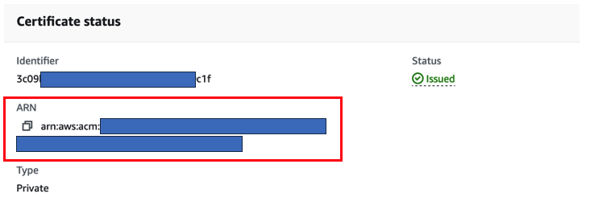

# Amazon VPC Lattice TLS Passthrough with Websersvers as backend

## Architecture


## Resources created in this template
- [ ] 1 Amazon VPC called Consumer VPC, with 2 private subnets, acting as a consumer of the service.
- [ ] 1 Amazon VPC called Producer VPC, with 2 private subnets, acting as a producer of the service.
- [ ] Endpoints in the Consumer VPC: AWS Systems Manager endpoints to access to Amazon EC2 instances via Sessions Manager and 1 Amazon S3 Gateway endpoint. 
- [ ] Endpoints in the Producer VPC: AWS Systems Manager endpoints to access to Amazon EC2 instances via Sessions Manager and 1 Amazon S3 Gateway endpoint.
- [ ] 1 Amazon S3 bucket to store the exported private certificate resources from ACM to be later installed in the Amazon EC2 instances upon creation.
- [ ] Amazon VPC Lattice resources.
- [ ] Amazon Route 53 Private Hosted Zone for the Amazon VPC Lattice Service domain name.
- [ ] AWS IAM roles
- [ ] AWS Lambda Functions: 1 function to associate the Amazon VPC Lattice target group to Amazon EC2 Autoscaling group, 1 function to create a random string to be used to randomize name of resources and 1 function to empty Amazon S3 bucket upon deletion of the AWS CloudFormation template.
- [ ] 1 Amazon EC2 instance in the Consumer VPC, called Consumer Instance, acting as a client (consumer) of the Amazon VPC Lattice service. This instance has the certificate chain installed. 
- [ ] 2 Amazon EC2 instances in the Producer VPC in autoscaling, acting as servers (producers) of the Amazon VPC Lattice service.

## Requirements to deploy (AWS CloudFormation Parameters)

- [ ] You need to have a private certificate imported to AWS Certificate Manager. **Important: You need a private certificate issued by a private certificate authority (CA) for use anywhere. For example, AWS Private CA**


- [ ] Have the ARN of the private certificate manager handy, as you need to give it as an input to AWS CloudFormation when launching the template via the console.



- [ ] The application that will act as a "Producer" (your backend) will be accessed privately through a domain name. You also have to give it as an input to AWS CloudFormation. Following the domain name in the firs image above, this domain name should be: "YourAppName".vpclattice.com

- [ ] When the Amazon VPC Lattice Service is created, an Amazon Route53 private hosted zone with service's domain name as the target, needs to be created. This will be created automatically for you but you need to enter the hosted zone name in the AWS Cloudformation console. Following the example with the above images, the name entered as the hosted zone should be "vpclattice.com"

- [ ] The last requirement is to enter a certificate passphrase. When deploying the Apache application with TLS (Transport Layer Security) enabled using our CloudFormation template, we require a passphrase as a parameter. This passphrase is used to encrypt the private key of your SSL/TLS certificate. You can enter whatever string you want.

## How to deploy

- [ ] Clone or download this repo
- [ ] Go to AWS CloudFormation console and click on create stack [with new resources (standard)]
- [ ] Upload the template called "main.yaml" you just cloned or downloaded from this repo
- [ ] Enter the parameters. See the image below for an extra guidance:


- [ ] Click next, leave all parameters as default and click next again
- [ ] Scroll down check the box that says "I acknowledge that AWS CloudFormation might create IAM resources" and click "Submit"

**NOTE: The template takes 10 minutes to deploy (approx.)**

## Test the end to end TLS communication from client to server with Amazon VPC Lattice

- [ ] Go to Amazon EC2 console and select the instance called "Consumer Server" and click "connect" with Session Manager. 


**NOTE: If the "Connect" button is not clickable. Please wait 2 minutes and reload the page.**

- [ ] Enter a the following Curl command: 
```
curl https://"YourAppName"."YourDomain".com
```
Following the example in this repo, the commando would be: 


- [ ] Add "-v" to the command to gain more insight into the communication between the Consumer Server (client) and the server.


## Authors
- [ ] Daniel Neri
- [ ] Victor Solaz
